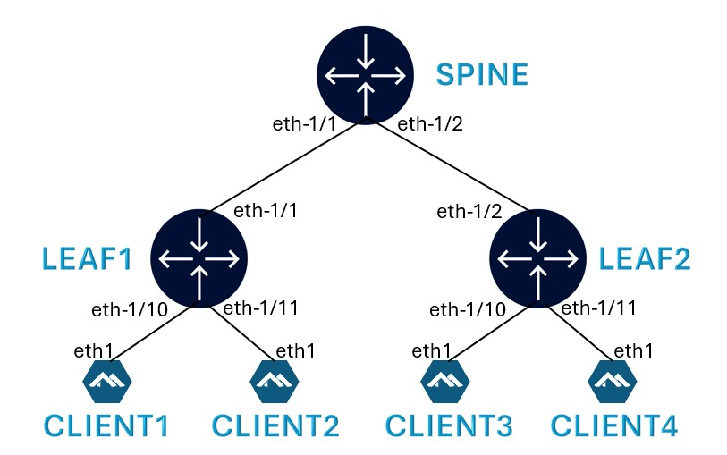
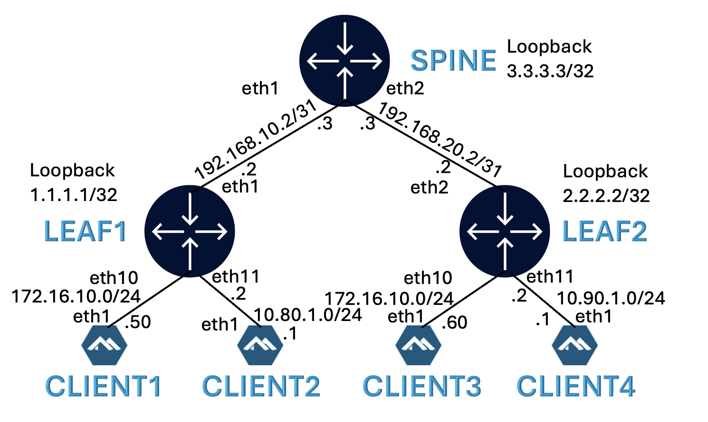
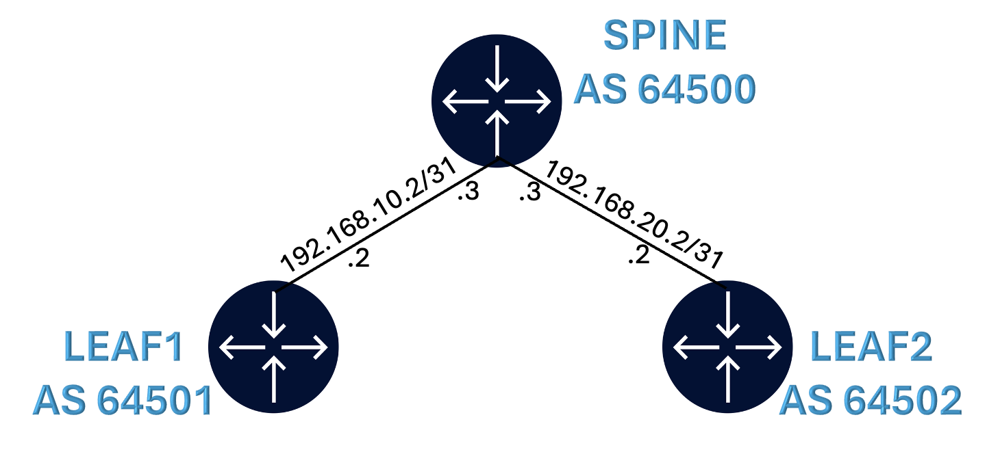
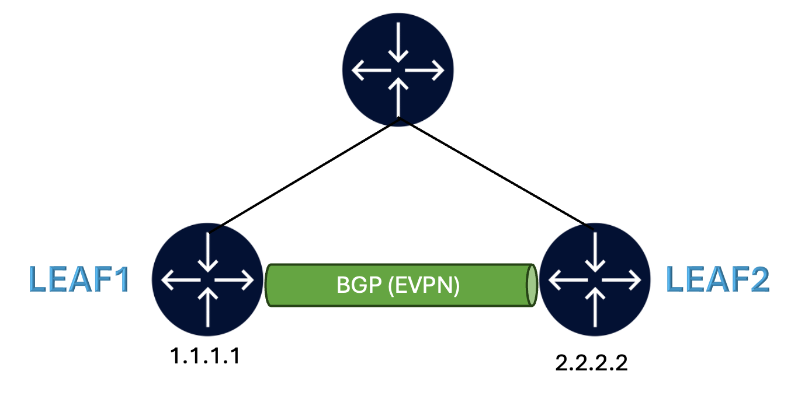
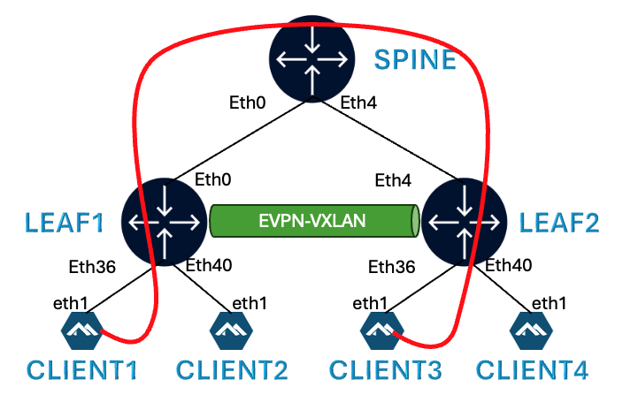
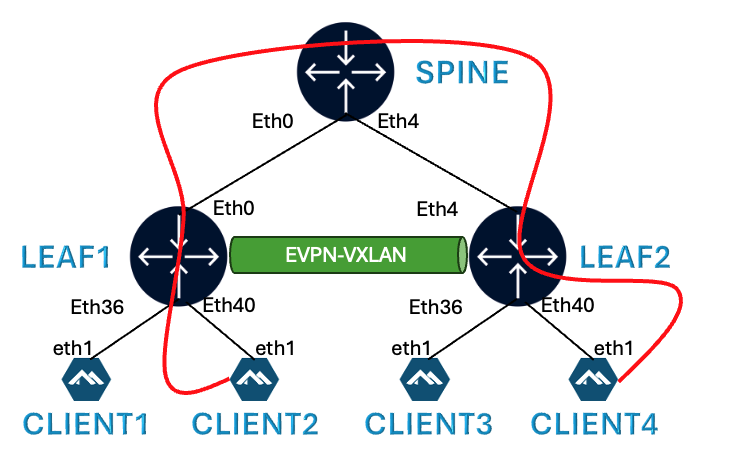

# Welcome to the SONiC Workshop at NANOG 97

This README is your starting point into the hands on section.

Pre-requisite: A laptop with SSH client

Shortcut links to major sections in this README:

|   |   |
|---|---|
| [Lab Topology](#lab-topology) | [Deploying the lab](#deploying-the-lab) |
| [BGP Underay](#configure-bgp-underlay) | [BGP Overlay](#configure-bgp-for-overlay) |
| [Layer 2 EPVN](#configure-l2-evpn-vxlan) | [Layer 3 EVPN](#configure-layer-3-evpn-vxlan) |
| [CLI Quick Reference](#sr-linux-configuration-mode) | [Bonus](#bonus---interconnecting-layer-2-and-layer-3-using-irb) |

## Lab Environment

A team member will provide you with a card that contains:
- your VM hostname
- SSH credentials to the VM instance
- URL of this repo

> <p style="color:red">!!! Make sure to backup any code, config, ... <u> offline (e.g on your laptop)</u>. 
> The VM instances will be destroyed once the Workshop is concluded.</p>

## Workshop
The objective of the hands on section of this workshop is the following:
- Build a DC fabric with leaf and spine
- Build Layer 2 EVPN-VXLAN
- Build Layer 3 EVPN-VXLAN

## Lab Topology

Each workshop participant will be provided with the below topology consisting of 2 leaf and 1 spine nodes along with 4 clients.



## NOS (Network Operating System)

Both leafs and Spine nodes will be running the latest SONiC 202511 release.

SONiC NOS has 2 main Command Line Interfaces:

- SONiC (default cli) - sample prompt `admin@leaf1:~$`
- FRR (enter using `vtysh` from SONiC CLI) - sample prompt `leaf1#`

For all configuration and show commands listed in this workshop, we specify the CLI from where it should be executed.

All 4 clients will be running [Alpine Linux](https://alpinelinux.org/)

## Installing Containerlab

Install Containerlab on your VM.

```bash
curl -sL https://containerlab.dev/setup | sudo -E bash -s "all"
```

Logout and login for the sudo privileges to take effect.

## Importing SONiC docker image

SONiC docker image (made using [vrnetlab](https://github.com/srl-labs/vrnetlab/tree/master) is available on your VM.

```bash
ls -lrt /images/docker-sonic-vs-2511
```

Import this image to docker repo

```bash
docker load -i /images/docker-sonic-vs-2511
```

Verify that the image is available in the docker repo

```bash
docker images
```

Expected output:

```bash
REPOSITORY                                  TAG        IMAGE ID       CREATED         SIZE
vrnetlab/sonic_sonic-vs                     2511       d1afa72af30e   2 weeks ago     5.91GB
```

## Deploying the lab

Use the below command to clone this repo to your VM.

```bash
sudo git clone https://github.com/sajusal/n97-sonic.git
```

Verify that the git repo files are available on your VM.

```bash
ls -lrt n97-sonic/
```

To deploy the lab, run the following:

```bash
cd n97-sonic
sudo clab deploy -t sonic-evpn.clab.yml
```

[Containerlab](https://containerlab.dev/) will deploy the lab and display a table with the list of nodes and their IPs.

```bash
# clab dep -t sonic-evpn.clab.yml --reconfigure
18:36:47 INFO Containerlab started version=0.75.0
18:36:47 INFO Parsing & checking topology file=sonic-evpn.clab.yml
18:36:47 INFO Removing directory path=/root/nanog/clab-sonic-evpn
18:36:47 INFO Creating docker network name=sonic-evpn-lab-mgmt IPv4 subnet=172.40.30.0/24 IPv6 subnet=2001:172:40:30::/64 MTU=0
18:36:47 INFO Creating lab directory path=/root/nanog/clab-sonic-evpn
18:36:47 INFO Creating container name=client2
18:36:47 INFO Creating container name=leaf1
18:36:47 INFO Creating container name=spine
18:36:47 INFO Creating container name=client1
18:36:47 INFO Creating container name=leaf2
18:36:47 INFO Creating container name=client4
18:36:47 INFO Creating container name=client3
18:36:48 INFO Created link: leaf1:eth1 ▪┄┄▪ spine:eth1
18:36:48 INFO Created link: leaf2:eth2 ▪┄┄▪ spine:eth2
18:36:48 INFO Created link: client3:eth1 ▪┄┄▪ leaf2:eth10
18:36:48 INFO Created link: client4:eth1 ▪┄┄▪ leaf2:eth11
18:36:48 INFO Created link: client1:eth1 ▪┄┄▪ leaf1:eth10
18:36:48 INFO Created link: client2:eth1 ▪┄┄▪ leaf1:eth11
18:36:48 INFO Executed command node=client1 command="ip address add 172.16.10.50/24 dev eth1" stdout=""
18:36:48 INFO Executed command node=client1 command="ip route add 10.90.1.0/24 via 172.16.10.254" stdout=""
18:36:48 INFO Executed command node=client1 command="ip route add 10.80.1.0/24 via 172.16.10.254" stdout=""
18:36:48 INFO Executed command node=client2 command="ip address add 10.80.1.1/24 dev eth1" stdout=""
18:36:48 INFO Executed command node=client2 command="ip route add 10.90.1.0/24 via 10.80.1.2" stdout=""
18:36:48 INFO Executed command node=client2 command="ip route add 172.16.10.0/24 via 10.80.1.2" stdout=""
18:36:48 INFO Executed command node=client3 command="ip address add 172.16.10.60/24 dev eth1" stdout=""
18:36:48 INFO Executed command node=client3 command="ip route add 10.90.1.0/24 via 172.16.10.253" stdout=""
18:36:48 INFO Executed command node=client3 command="ip route add 10.80.1.0/24 via 172.16.10.253" stdout=""
18:36:48 INFO Executed command node=client4 command="ip address add 10.90.1.1/24 dev eth1" stdout=""
18:36:48 INFO Executed command node=client4 command="ip route add 10.80.1.0/24 via 10.90.1.2" stdout=""
18:36:48 INFO Executed command node=client4 command="ip route add 172.16.10.0/24 via 10.90.1.2" stdout=""
18:36:48 INFO Adding host entries path=/etc/hosts
18:36:48 INFO Adding SSH config for nodes path=/etc/ssh/ssh_config.d/clab-sonic-evpn.conf
╭─────────┬─────────────────────────────────────────────┬────────────────────┬────────────────────╮
│   Name  │                  Kind/Image                 │        State       │   IPv4/6 Address   │
├─────────┼─────────────────────────────────────────────┼────────────────────┼────────────────────┤
│ client1 │ linux                                       │ running            │ 172.40.30.10       │
│         │ ghcr.io/mfzhsn/network-multitool-sshd:0.0.5 │                    │ 2001:172:40:30::10 │
├─────────┼─────────────────────────────────────────────┼────────────────────┼────────────────────┤
│ client2 │ linux                                       │ running            │ 172.40.30.11       │
│         │ ghcr.io/mfzhsn/network-multitool-sshd:0.0.5 │                    │ 2001:172:40:30::11 │
├─────────┼─────────────────────────────────────────────┼────────────────────┼────────────────────┤
│ client3 │ linux                                       │ running            │ 172.40.30.12       │
│         │ ghcr.io/mfzhsn/network-multitool-sshd:0.0.5 │                    │ 2001:172:40:30::12 │
├─────────┼─────────────────────────────────────────────┼────────────────────┼────────────────────┤
│ client4 │ linux                                       │ running            │ 172.40.30.13       │
│         │ ghcr.io/mfzhsn/network-multitool-sshd:0.0.5 │                    │ 2001:172:40:30::13 │
├─────────┼─────────────────────────────────────────────┼────────────────────┼────────────────────┤
│ leaf1   │ sonic-vm                                    │ running            │ 172.40.30.2        │
│         │ vrnetlab/sonic_sonic-vs:2511                │ (health: starting) │ 2001:172:40:30::2  │
├─────────┼─────────────────────────────────────────────┼────────────────────┼────────────────────┤
│ leaf2   │ sonic-vm                                    │ running            │ 172.40.30.4        │
│         │ vrnetlab/sonic_sonic-vs:2511                │ (health: starting) │ 2001:172:40:30::4  │
├─────────┼─────────────────────────────────────────────┼────────────────────┼────────────────────┤
│ spine   │ sonic-vm                                    │ running            │ 172.40.30.3        │
│         │ vrnetlab/sonic_sonic-vs:2511                │ (health: starting) │ 2001:172:40:30::3  │
╰─────────┴─────────────────────────────────────────────┴────────────────────┴────────────────────╯
```

To display all deployed labs on your VM at any time, use:

```bash
sudo clab inspect --all
```

## Connecting to the devices

Find the nodename or IP address of the device from the above output and then use SSH.

Username: `admin`

Password: Refer to the provided card

```bash
ssh admin@leaf1
```

To login to the client, identify the client hostname using the `sudo clab inspect --all` command above and then:

```bash
sudo docker exec –it client3 sh
```

## Physical link connectivity

When the lab is deployed with the default startup config, all the links are created with IPv4 addresses.

This allows to start configuring the protocols right away.

Check the [startup config](configs/fabric-config/) files to see how these objects are configured in SONiC.

After logging in to a SONiC switch, switch to the FRR CLI using:

```bash
vtysh
```

To view Interface status on SONiC use:

```bash
show interface brief
```

### IPv4 Link Addressing



### Verify reachability between devices

After the lab is deployed, check reachability between leaf and spine devices using ping.

Example on spine to Leaf1:

```bash
ping 192.168.10.2
```

Stop the ping using CTRL+c

## Configure BGP Underlay

We are now ready to start configuring the fabric for EVPN.

The first step is to configure BGP for underlay.

Underlay refers to the physical connectivity between Leaf and Spine that are directly connected. This forms the basis for reachability of a node from all other nodes.

BGP is commonly used for this purpose in a Data Center network. Other options are OSPF or IS-IS.

Each Leaf is in a separate Autonomous System (AS) and Spine is in it's own AS. This is typical in a Clos network.

We will use the IPv4 interface address to form BGP sessions between Leaf and Spine nodes.

We will export the loopback IP over BGP to other nodes. This is required to create our overlay sessions in the next step.



### BGP Underlay Configuration

From FRR CLI (enter using `vtysh`), get into configuration mode by entering:

```bash
config
```

BGP underlay configuration on Leaf1:

```bash
router bgp 64501
 bgp router-id 1.1.1.1
 no bgp ebgp-requires-policy
 neighbor 192.168.10.3 remote-as 64500
 !
 address-family ipv4 unicast
  network 1.1.1.1/32
  redistribute connected
 exit-address-family
 !
exit
!
```

BGP underlay configuration on Leaf2:

```bash
router bgp 64502
 bgp router-id 2.2.2.2
 no bgp ebgp-requires-policy
 neighbor 192.168.20.3 remote-as 64500
 !
 address-family ipv4 unicast
  network 2.2.2.2/32
  redistribute connected
 exit-address-family
 !
exit
!
```

BGP underlay configuration on Spine:

```bash
router bgp 64500
 bgp router-id 3.3.3.3
 no bgp ebgp-requires-policy
 neighbor 192.168.10.2 remote-as 64501
 !
 neighbor 192.168.20.2 remote-as 64502
 !
 address-family ipv4 unicast
  network 3.3.3.3/32
  redistribute connected
 exit-address-family
 !
exit
!
```

### BGP Underlay Verification

The BGP underlay sessions should be UP now. Check using the following command on the Spine (while inside config mode).

```bash
do show bgp ipv4 neighbors
```

The output below confirms that IPv4 BGP neighbor sessions are established between Spine and the 2 Leaf nodes.

```bash
BGP neighbor is 192.168.10.2, remote AS 64501, local AS 64500, external link
  Local Role: undefined
  Remote Role: undefined
Hostname: sonic
  BGP version 4, remote router ID 1.1.1.1, local router ID 3.3.3.3
  BGP state = Established, up for 00:08:36
<--snip-->
BGP neighbor is 192.168.20.2, remote AS 64502, local AS 64500, external link
  Local Role: undefined
  Remote Role: undefined
Hostname: sonic
  BGP version 4, remote router ID 2.2.2.2, local router ID 3.3.3.3
  BGP state = Established, up for 00:06:17
<--snip-->
```

The route table for the default network instance (VRF) should now show the system loopback IP of other nodes.

```bash
do show ip route
```

Output on Leaf1:

```bash
Codes: K - kernel route, C - connected, L - local, S - static,
       R - RIP, O - OSPF, I - IS-IS, B - BGP, E - EIGRP, N - NHRP,
       T - Table, v - VNC, V - VNC-Direct, A - Babel, F - PBR,
       f - OpenFabric, t - Table-Direct,
       > - selected route, * - FIB route, q - queued, r - rejected, b - backup
       t - trapped, o - offload failure

IPv4 unicast VRF default:
K>* 0.0.0.0/0 [0/202] via 10.0.0.2, eth0, weight 1, 00:13:40
B>* 1.1.1.1/32 [20/0] via 192.168.10.2, Ethernet0, rmapsrc 3.3.3.3, weight 1, 00:12:36
B>* 2.2.2.2/32 [20/0] via 192.168.20.2, Ethernet4, rmapsrc 3.3.3.3, weight 1, 00:10:17
C>* 3.3.3.3/32 is directly connected, Loopback0, weight 1, 00:13:39
C>* 10.0.0.0/24 is directly connected, eth0, weight 1, 00:13:40
B>* 10.80.1.0/24 [20/0] via 192.168.10.2, Ethernet0, rmapsrc 3.3.3.3, weight 1, 00:12:36
B>* 10.90.1.0/24 [20/0] via 192.168.20.2, Ethernet4, rmapsrc 3.3.3.3, weight 1, 00:10:17
C>* 192.168.10.2/31 is directly connected, Ethernet0, weight 1, 00:13:40
C>* 192.168.20.2/31 is directly connected, Ethernet4, weight 1, 00:13:39
```

Now we are ready to configure the overlay.

## Configure BGP for Overlay

Overlay refers to the connectivity between nodes that are not necessarily directly connected.

Our end goal is to have an EVPN service between Leaf1 and Leaf2. BGP is required to advertise EVPN routes between the leaf devices.

For establishing overlay BGP session between Leaf1 and Leaf2, we will use the Loopback0 IP of the Leaf nodes. These IPs are pre-configured as part of initial lab deployment and can be verified using `show interface Loopback0` command.

BGP overlay configuration is not required on the Spine as Spine is not aware of EVPN routes.



### BGP Overlay Configuration

BGP Overlay configuration on Leaf1:

```bash
router bgp 64501
 neighbor 3.3.3.3 remote-as 64500
 neighbor 3.3.3.3 update-source Loopback0
 neighbor 3.3.3.3 ebgp-multihop 2
 !
 address-family l2vpn evpn
  neighbor 3.3.3.3 activate
 exit-address-family
address-family ipv4 unicast
  no neighbor 3.3.3.3 activate
 !
exit
!
```

BGP Overlay configuration on Leaf2:

```bash
router bgp 64502
 neighbor 3.3.3.3 remote-as 64500
 neighbor 3.3.3.3 update-source Loopback0
 neighbor 3.3.3.3 ebgp-multihop 2
 !
 address-family l2vpn evpn
  neighbor 3.3.3.3 activate
 exit-address-family
address-family ipv4 unicast
  no neighbor 3.3.3.3 activate
 !
exit
!
```

BGP Overlay configuration on Spine:

```bash
router bgp 64500
 neighbor 1.1.1.1 remote-as 64501
 neighbor 1.1.1.1 update-source Loopback0
 neighbor 1.1.1.1 ebgp-multihop 2
 neighbor 2.2.2.2 remote-as 64502
 neighbor 2.2.2.2 update-source Loopback0
 neighbor 2.2.2.2 ebgp-multihop 2
 !
 address-family l2vpn evpn
  neighbor 1.1.1.1 activate
  neighbor 2.2.2.2 activate
 exit-address-family
address-family ipv4 unicast
  no neighbor 1.1.1.1 activate
address-family ipv4 unicast
  no neighbor 2.2.2.2 activate
 !
exit
!
```

### BGP Overlay Verification

The BGP overlay sessions should be UP now. Check using the following command on Leaf1.

```bash
show bgp neighbors 3.3.3.3
```

The output confirms that EVPN neighbor sessions are established to Loopback0 IP.

The devices are not currently advertising any EVPN routes.

```bash
BGP neighbor is 3.3.3.3, remote AS 64500, local AS 64501, external link
  Local Role: undefined
  Remote Role: undefined
Hostname: spine
  BGP version 4, remote router ID 3.3.3.3, local router ID 1.1.1.1
  BGP state = Established, up for 00:01:35
<--snip-->
 For address family: L2VPN EVPN
  Update group 6, subgroup 8
  Packet Queue length 0
  NEXT_HOP is propagated unchanged to this neighbor
  Community attribute sent to this neighbor(all)
  0 accepted, 0 sent prefixes
```

## Configure L2 EVPN-VXLAN

Now that we have established our underlay and overlay connectivity, our next step is to configure the Layer 2 EVPN-VXLAN instance.

The objective is to establish a connection between Client 1 (connected to Leaf1) and Client 3 (connected to Leaf2).

Both the clients are in the same subnet (172.16.10.0/24) and therefore, this will be a Layer 2 connection. From a client perspective, it is just like they are connected to a Layer 2 switch.



### Configure Client Interface

IP addresses on the client side are pre-configured (on interface eth1) during deployment. This can be verified by logging in to the Client shell and running `ip a`.

To login to Client1, use:
```bash
sudo docker exec -it client1 sh
```

Output on Client1:

```bash
/ # ip a
<--truncated-->
20: eth1@if19: <BROADCAST,MULTICAST,UP,LOWER_UP,M-DOWN> mtu 9500 qdisc noqueue state UP
    link/ether aa:c1:ab:81:49:35 brd ff:ff:ff:ff:ff:ff
    inet 172.16.10.50/24 scope global eth1
       valid_lft forever preferred_lft forever
    inet6 fe80::a8c1:abff:fe81:4935/64 scope link
       valid_lft forever preferred_lft forever
```

### Configuring VXLAN

VXLAN is the transport protocol for this EVPN instance.

All data packets will be encapsulated in VXLAN and transported to the destination.

On each Leaf, a VXLAN tunnel interface should be created with a unique VNI.

Configuring VXLAN on Leaf1 - using **SONiC CLI**:

```bash
sudo config vxlan add vtep 1.1.1.1
sudo config vxlan evpn_nvo add nvo vtep
```

Configuring VXLAN on Leaf2:

```srl
sudo config vxlan add vtep 2.2.2.2
sudo config vxlan evpn_nvo add nvo vtep
```

### Configuring Layer 2 EVPN-VXLAN

In this step, we will configure a mac-vrf or VLAN on each Leaf and add the client facing untagged interface along with the VXLAN tunnel interface to the VLAN instance.

| Node | VLAN | VNI | Access Port | Tagging |
|---|---:|---:|---|---|
| Leaf1 | `110` | `10110` | `Ethernet36` | untagged |
| Leaf2 | `110` | `10110` | `Ethernet36` | untagged |

EVPN-VXLAN configuration on both Leaf1 - using **SONiC CLI**:

```bash
sudo config vlan add 110
sudo config interface startup Ethernet36
sudo config vlan member add -u 110 Ethernet36
sudo config vxlan map add vtep 110 10110
sudo config save -y
```

EVPN-VXLAN configuration on both Leaf2 - using **SONiC CLI**:

```bash
sudo config vlan add 110
sudo config interface startup Ethernet36
sudo config vlan member add -u 110 Ethernet36
sudo config vxlan map add vtep 110 10110
sudo config save -y
```

Enable BGP to advertise VNI:

On both Leaf1 and Leaf2, run the following command from FRR cli - using **vtysh**:

```bash
router bgp 64501
 address-family l2vpn evpn
  advertise-all-vni
```

### Ping between Client 1 & 3

Verify if Client 3 is able to ping Client 1

Login to Client3 using:

```bash
sudo docker exec -it client3 sh
```

Run `ip a` and note down the MAC address of eth1 interface (facing Leaf2).

```bash
# sudo docker exec -it client3 sh
/ # ip a
26: eth1@if25: <BROADCAST,MULTICAST,UP,LOWER_UP,M-DOWN> mtu 9500 qdisc noqueue state UP
    link/ether aa:c1:ab:67:32:61 brd ff:ff:ff:ff:ff:ff
    inet 172.16.10.60/24 scope global eth1
       valid_lft forever preferred_lft forever
    inet6 fe80::a8c1:abff:fe3f:aed8/64 scope link
       valid_lft forever preferred_lft forever
/ #
```

The MAC address of Client3 eth1 interface is aa:c1:ab:67:32:61. This could be different in your setup.

Ping Client1 IP from Client3. Leave the ping running until this section is completed.

```bash
ping 172.16.10.50
```

Output on Client1:

```bash
/ # ping 172.16.10.50
PING 172.16.10.50 (172.16.10.50): 56 data bytes
64 bytes from 172.16.10.50: seq=0 ttl=64 time=0.886 ms
```

### Layer 2 EVPN verification

Verify the vlan (mac-vrf) configuration on leaf1.

Using **SONiC CLI**:

```bash
show vlan brief
```

Expected output on leaf1:

```bash
+-----------+--------------+------------+----------------+-------------+-----------------------+
|   VLAN ID | IP Address   | Ports      | Port Tagging   | Proxy ARP   | DHCP Helper Address   |
+===========+==============+============+================+=============+=======================+
|       110 |              | Ethernet36 | untagged       | disabled    |                       |
+-----------+--------------+------------+----------------+-------------+-----------------------+
```

Verify client facing interface status on leaf1:

Using **SONiC CLI**:

```bash
show interfaces status | egrep "Interface|--|Ethernet36"
```

Expected output on leaf1:

```bash
  Interface            Lanes       Speed    MTU    FEC           Alias    Vlan    Oper    Admin    Type    Asym PFC
-----------  ---------------  ----------  -----  -----  --------------  ------  ------  -------  ------  ----------
 Ethernet36       9,10,11,12  4294967.3G   9100    N/A   fortyGigE0/36   trunk      up       up     N/A         N/A
```

Verify VXLAN tunnel on leaf1:

Using **SONiC CLI**:

```bash
show vxlan tunnel
```

Expected output on leaf1:

```bash
vxlan tunnel name    source ip    destination ip    tunnel map name    tunnel map mapping(vni -> vlan)
-------------------  -----------  ----------------  -----------------  ---------------------------------
vtep                 1.1.1.1                        map_10110_Vlan110  10110 -> Vlan110
```

Verify VXLAN Remote MAC on leaf1:

Using **SONiC CLI**:

```bash
show vxlan remotemac 2.2.2.2
```

Expected output on leaf1:

```
+---------+-------------------+--------------+-------+---------+
| VLAN    | MAC               | RemoteVTEP   |   VNI | Type    |
+=========+===================+==============+=======+=========+
| Vlan110 | aa:c1:ab:99:75:47 | 2.2.2.2      | 10110 | dynamic |
+---------+-------------------+--------------+-------+---------+
Total count : 1
```

EVPN will advertise Route Type 3 Inclusive Multicast Ethernet Tag (IMET) to discover leaf devices and setup tree for BUM (Broadcast, Unknown, Multicast) traffic.

This route advertisement can be seen in the BGP show output using the below command.

On leaf1, using **FRR CLI**:

```bash
show bgp l2vpn evpn route type 3
```

Output on Leaf1:

```bash
BGP table version is 7, local router ID is 1.1.1.1
Status codes: s suppressed, d damped, h history, * valid, > best, i - internal
Origin codes: i - IGP, e - EGP, ? - incomplete
EVPN type-1 prefix: [1]:[EthTag]:[ESI]:[IPlen]:[VTEP-IP]:[Frag-id]
EVPN type-2 prefix: [2]:[EthTag]:[MAClen]:[MAC]:[IPlen]:[IP]
EVPN type-3 prefix: [3]:[EthTag]:[IPlen]:[OrigIP]
EVPN type-4 prefix: [4]:[ESI]:[IPlen]:[OrigIP]
EVPN type-5 prefix: [5]:[EthTag]:[IPlen]:[IP]

   Network          Next Hop            Metric LocPrf Weight Path
                    Extended Community
Route Distinguisher: 1.1.1.1:2
 *>  [3]:[0]:[32]:[1.1.1.1]
                    1.1.1.1                            32768 i
                    ET:8 RT:64501:10110
Route Distinguisher: 2.2.2.2:2
 *>  [3]:[0]:[32]:[2.2.2.2]
                    2.2.2.2                                0 64500 64502 i
                    RT:64502:10110 ET:8

Displayed 2 prefixes (2 paths) (of requested type)
```

Now let's verify the MAC-IP advertisement using EVPN Route Type 2.

Run the below command on Leaf1 to see this route advertisement. Verify if the MAC address in the table below is the same MAC address we noted above for Client3.

Using **FRR CLI**:

```bash
show bgp l2vpn evpn route type 2
```

Output on Leaf1:

```bash
BGP table version is 7, local router ID is 1.1.1.1
Status codes: s suppressed, d damped, h history, * valid, > best, i - internal
Origin codes: i - IGP, e - EGP, ? - incomplete
EVPN type-1 prefix: [1]:[EthTag]:[ESI]:[IPlen]:[VTEP-IP]:[Frag-id]
EVPN type-2 prefix: [2]:[EthTag]:[MAClen]:[MAC]:[IPlen]:[IP]
EVPN type-3 prefix: [3]:[EthTag]:[IPlen]:[OrigIP]
EVPN type-4 prefix: [4]:[ESI]:[IPlen]:[OrigIP]
EVPN type-5 prefix: [5]:[EthTag]:[IPlen]:[IP]

   Network          Next Hop            Metric LocPrf Weight Path
                    Extended Community
Route Distinguisher: 1.1.1.1:2
 *>  [2]:[0]:[48]:[aa:c1:ab:6b:99:b0]
                    1.1.1.1                            32768 i
                    ET:8 RT:64501:10110
 *>  [2]:[0]:[48]:[aa:c1:ab:6b:99:b0]:[128]:[fe80::a8c1:abff:fe6b:99b0]
                    1.1.1.1                            32768 i
                    ET:8 RT:64501:10110
Route Distinguisher: 2.2.2.2:2
 *>  [2]:[0]:[48]:[aa:c1:ab:99:75:47]
                    2.2.2.2                                0 64500 64502 i
                    RT:64502:10110 ET:8
 *>  [2]:[0]:[48]:[aa:c1:ab:99:75:47]:[128]:[fe80::a8c1:abff:fe99:7547]
                    2.2.2.2                                0 64500 64502 i
                    RT:64502:10110 ET:8

Displayed 4 prefixes (4 paths) (of requested type)
```

### Packet Capture in Containerlab

Containerlab provides the ability to do a packet capture and re-direct the captured packets to Wireshark.

Visit [AC2 Workshop page](https://github.com/srlinuxamericas/ac2-clab/tree/main/40-packet-capture) to learn more.

## Configure Layer 3 EVPN-VXLAN

Our final step is to configure a Layer 3 EVPN-VXLAN.

The objective is to connect Client 2 and Client 4 over a Layer 3 EVPN.



### Configure Client Interface

Client2 & 4 are Layer 3 clients with IPs in different subnets.

Client Layer 3 interface configuration on Leaf1:

```srl
set / interface ethernet-1/11 description To-Client2
set / interface ethernet-1/11 admin-state enable
set / interface ethernet-1/11 subinterface 0 ipv4 admin-state enable
set / interface ethernet-1/11 subinterface 0 ipv4 address 10.80.1.2/24
set / interface ethernet-1/11 subinterface 0 ipv6 admin-state enable
set / interface ethernet-1/11 subinterface 0 ipv6 address 10:80:1::2/64
```

Client Layer 3 interface configuration on Leaf2:

```srl
set / interface ethernet-1/11 description To-Client4
set / interface ethernet-1/11 admin-state enable
set / interface ethernet-1/11 subinterface 0 ipv4 admin-state enable
set / interface ethernet-1/11 subinterface 0 ipv4 address 10.90.1.2/24
set / interface ethernet-1/11 subinterface 0 ipv6 admin-state enable
set / interface ethernet-1/11 subinterface 0 ipv6 address 10:90:1::2/64
```

IP addresses on the client side are pre-configured during deployment. This can be verified by logging in to the Client shell and running `ip a`.

### Configuring VXLAN

We will create a Layer 3 VXLAN tunnel between Leaf1 and Leaf2 with a unique VNI.

Configuring VXLAN on Leaf1:

```srl
set / tunnel-interface vxlan24 vxlan-interface 200 type routed
set / tunnel-interface vxlan24 vxlan-interface 200 ingress vni 200
```

Configuring VXLAN on Leaf2:

```srl
set / tunnel-interface vxlan24 vxlan-interface 200 type routed
set / tunnel-interface vxlan24 vxlan-interface 200 ingress vni 200
```

### Configuring Layer 3 EVPN-VXLAN

Layer 3 instance on SR Linux is called IP-VRF. To learn more about SR Linux Network Instances, visit [SR Linux Documentation](https://documentation.nokia.com/srlinux/24-7/books/config-basics/network-instances.html)

We will create an ip-vrf and include the client facing interface and the vxlan tunnel in this instance.

RD & RT will be separate from the Layer2 instance.

EVPN-VXLAN configuration on Leaf1:

```srl
set / network-instance ip-vrf-1 type ip-vrf
set / network-instance ip-vrf-1 admin-state enable
set / network-instance ip-vrf-1 interface ethernet-1/11.0
set / network-instance ip-vrf-1 vxlan-interface vxlan24.200
set / network-instance ip-vrf-1 protocols bgp-evpn bgp-instance 1 encapsulation-type vxlan
set / network-instance ip-vrf-1 protocols bgp-evpn bgp-instance 1 vxlan-interface vxlan24.200
set / network-instance ip-vrf-1 protocols bgp-evpn bgp-instance 1 evi 200
set / network-instance ip-vrf-1 protocols bgp-vpn bgp-instance 1 route-distinguisher rd 1.1.1.1:200
set / network-instance ip-vrf-1 protocols bgp-vpn bgp-instance 1 route-target export-rt target:65500:200
set / network-instance ip-vrf-1 protocols bgp-vpn bgp-instance 1 route-target import-rt target:65500:200
```

EVPN-VXLAN configuration on Leaf2:

```srl
set / network-instance ip-vrf-1 type ip-vrf
set / network-instance ip-vrf-1 admin-state enable
set / network-instance ip-vrf-1 interface ethernet-1/11.0
set / network-instance ip-vrf-1 vxlan-interface vxlan24.200
set / network-instance ip-vrf-1 protocols bgp-evpn bgp-instance 1 encapsulation-type vxlan
set / network-instance ip-vrf-1 protocols bgp-evpn bgp-instance 1 vxlan-interface vxlan24.200
set / network-instance ip-vrf-1 protocols bgp-evpn bgp-instance 1 evi 200
set / network-instance ip-vrf-1 protocols bgp-vpn bgp-instance 1 route-distinguisher rd 2.2.2.2:200
set / network-instance ip-vrf-1 protocols bgp-vpn bgp-instance 1 route-target export-rt target:65500:200
set / network-instance ip-vrf-1 protocols bgp-vpn bgp-instance 1 route-target import-rt target:65500:200
```

### Layer 3 EVPN Route Verification

When Layer 3 EVPN is enabled, the Leaf nodes will start advertising the client facing interface IPs to each other using EVPN IP-prefix Route Type 5.

This can verified using the below command.

```srl
show network-instance default protocols bgp routes evpn route-type summary
```

Output on Leaf1:

```srl
A:leaf1# show network-instance default protocols bgp routes evpn route-type summary
----------------------------------------------------------------------------------------------------------------------------------------------------------------------------------------------
Show report for the BGP route table of network-instance "default"
----------------------------------------------------------------------------------------------------------------------------------------------------------------------------------------------
Status codes: u=used, *=valid, >=best, x=stale
Origin codes: i=IGP, e=EGP, ?=incomplete
----------------------------------------------------------------------------------------------------------------------------------------------------------------------------------------------
Type 5 IP Prefix Routes
+--------+----------------------------+------------+---------------------+----------------------------+----------------------------+----------------------------+----------------------------+
| Status |    Route-distinguisher     |   Tag-ID   |     IP-address      |          neighbor          |          Next-Hop          |           Label            |          Gateway           |
+========+============================+============+=====================+============================+============================+============================+============================+
| u*>    | 2.2.2.2:200                | 0          | 10.90.1.0/24        | 2.2.2.2                    | 2.2.2.2                    | 200                        | 0.0.0.0                    |
| *      | 2.2.2.2:200                | 0          | 10.90.1.0/24        | 2001::2                    | 2.2.2.2                    | 200                        | 0.0.0.0                    |
| u*>    | 2.2.2.2:200                | 0          | 10:90:1::/64        | 2.2.2.2                    | 2.2.2.2                    | 200                        | ::                         |
| *      | 2.2.2.2:200                | 0          | 10:90:1::/64        | 2001::2                    | 2.2.2.2                    | 200                        | ::                         |
+--------+----------------------------+------------+---------------------+----------------------------+----------------------------+----------------------------+----------------------------+
----------------------------------------------------------------------------------------------------------------------------------------------------------------------------------------------
```

The remote routes will also be installed on the Leaf's route table.

Verify the VRF route table on Leaf1 using the below command:

```srl
show network-instance ip-vrf-1 route-table ipv4-unicast summary
```

Output on Leaf1:

```srl
A:leaf1# show network-instance ip-vrf-1 route-table ipv4-unicast summary
----------------------------------------------------------------------------------------------------------------------------------------------------------------------------------------------
IPv4 unicast route table of network instance ip-vrf-1
----------------------------------------------------------------------------------------------------------------------------------------------------------------------------------------------
+--------------------------+-------+------------+----------------------+----------+----------+---------+------------+----------------+----------------+----------------+---------------------+
|          Prefix          |  ID   | Route Type |     Route Owner      |  Active  |  Origin  | Metric  |    Pref    |    Next-hop    |    Next-hop    |  Backup Next-  |   Backup Next-hop   |
|                          |       |            |                      |          | Network  |         |            |     (Type)     |   Interface    |   hop (Type)   |      Interface      |
|                          |       |            |                      |          | Instance |         |            |                |                |                |                     |
+==========================+=======+============+======================+==========+==========+=========+============+================+================+================+=====================+
| 10.80.1.0/24             | 3     | local      | net_inst_mgr         | True     | ip-vrf-1 | 0       | 0          | 10.80.1.2      | ethernet-      |                |                     |
|                          |       |            |                      |          |          |         |            | (direct)       | 1/11.0         |                |                     |
| 10.80.1.2/32             | 3     | host       | net_inst_mgr         | True     | ip-vrf-1 | 0       | 0          | None (extract) | None           |                |                     |
| 10.80.1.255/32           | 3     | host       | net_inst_mgr         | True     | ip-vrf-1 | 0       | 0          | None           |                |                |                     |
|                          |       |            |                      |          |          |         |            | (broadcast)    |                |                |                     |
| 10.90.1.0/24             | 0     | bgp-evpn   | bgp_evpn_mgr         | True     | ip-vrf-1 | 0       | 170        | 2.2.2.2/32 (in |                |                |                     |
|                          |       |            |                      |          |          |         |            | direct/vxlan)  |                |                |                     |
+--------------------------+-------+------------+----------------------+----------+----------+---------+------------+----------------+----------------+----------------+---------------------+
----------------------------------------------------------------------------------------------------------------------------------------------------------------------------------------------
```

### Ping between Client 2 & 4

Login to client2 using:

```bash
sudo docker exec -it client2 sh
```

Ping Client4 IP from Client2:

```bash
ping -c 1 10.90.1.1
```

Expected output:

```bash
PING 10.90.1.1 (10.90.1.1): 56 data bytes
64 bytes from 10.90.1.1: seq=0 ttl=253 time=2.208 ms

--- 10.90.1.1 ping statistics ---
1 packets transmitted, 1 packets received, 0% packet loss
round-trip min/avg/max = 2.208/2.208/2.208 ms
```

Let's understand how this ping worked.

On Client2, there is a static route defined for destination 10.90.1.0/24 with Leaf1 as next-hop. This can be verified using `ip r` command on the Client.

```bash
/ # ip r
default via 172.20.20.1 dev eth0
10.80.1.0/24 dev eth1 scope link  src 10.80.1.1
10.90.1.0/24 via 10.80.1.2 dev eth1
172.20.20.0/24 dev eth0 scope link  src 172.20.20.4
```

When the ICMP ping packet reaches Leaf1, it checks the destination IP (10.90.1.1) against it's route-table. As seen in the above route-table output, the next-hop for this destination is a VXLAN tunnel to 2.2.2.2 (Leaf2) with VNI 200.

The ICMP packet is encapsulated in VXLAN and sent to 2.2.2.2 (Leaf2). On Leaf2, the VXLAN encapsulation is removed and the ICMP packet is forwarded to the Client. The ping reponse follows similar path back to Leaf1.

## Explore this lab with everything pre-configured

If you would like to explore all of the above without doing any manual configurations, we got you covered !

Go to [Complete startup config](n92-evpn-lab/configs/fabric/startup-complete) to see the full configuration for each device.

In your topology file (srl-evpn.clab.yml), point the startup config file location to `configs/fabric/startup-complete/leaf1-startup-complete.cfg` (for Leaf1).

Destroy any existing lab using the command `sudo clab destroy -t srl-evpn.clab.yml --cleanup`.

Then deploy the lab using `sudo clab deploy -t srl-evpn.clab.yml`.

## Useful links

* [Network Developer Portal](https://network.developer.nokia.com/)
* [containerlab](https://containerlab.dev/)
* [gNMIc](https://gnmic.openconfig.net/)

### SR Linux
* [SR Linux documentation](https://documentation.nokia.com/srlinux/)
* [Learn SR Linux](https://learn.srlinux.dev/)
* [YANG Browser](https://yang.srlinux.dev/)
* [gNxI Browser](https://gnxi.srlinux.dev/)
* [Ansible Collection](https://learn.srlinux.dev/ansible/collection/)
